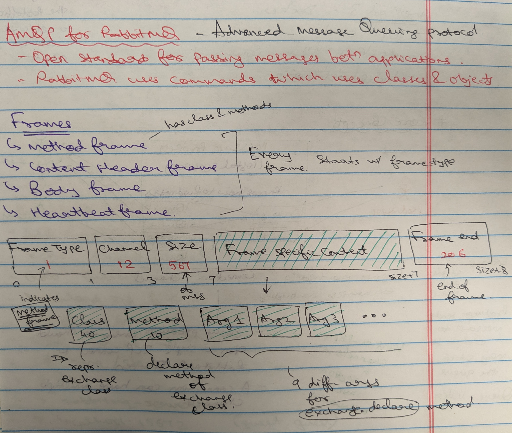
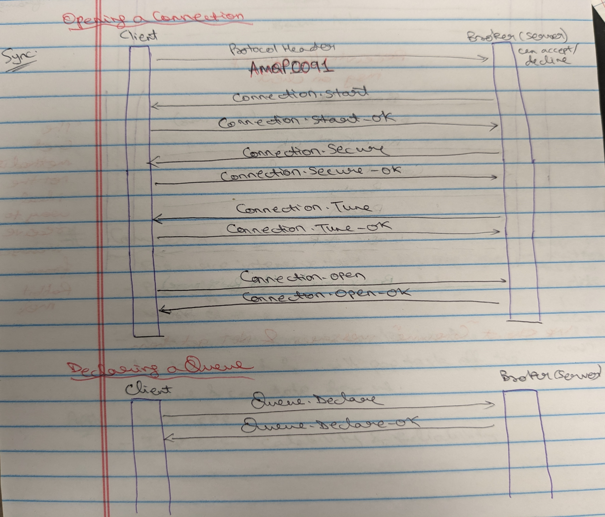
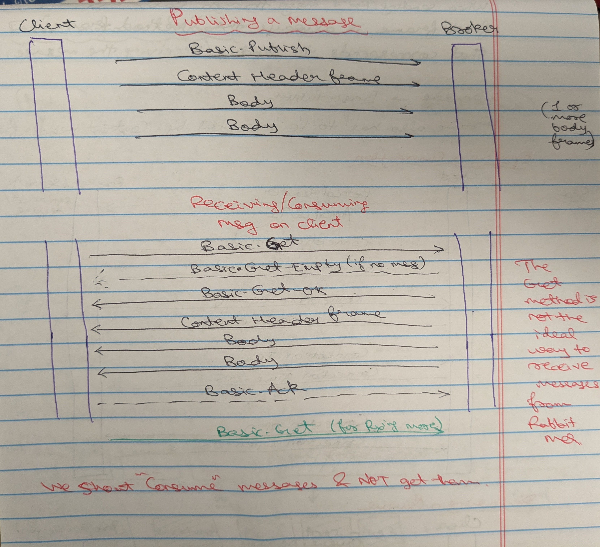
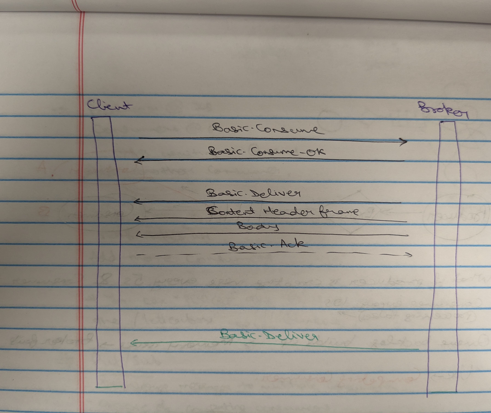
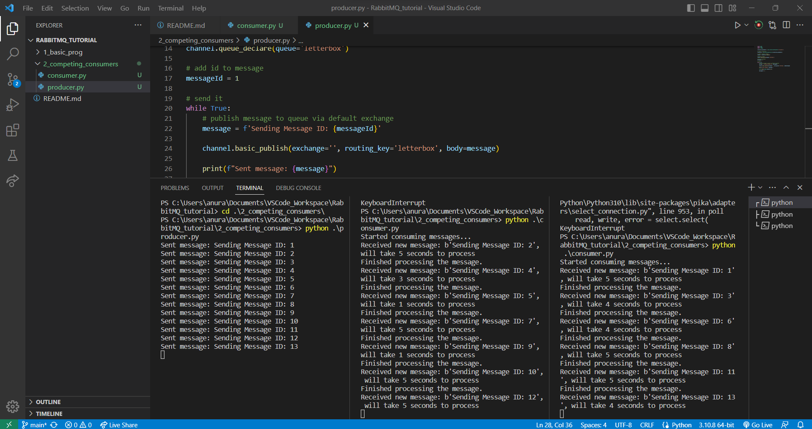
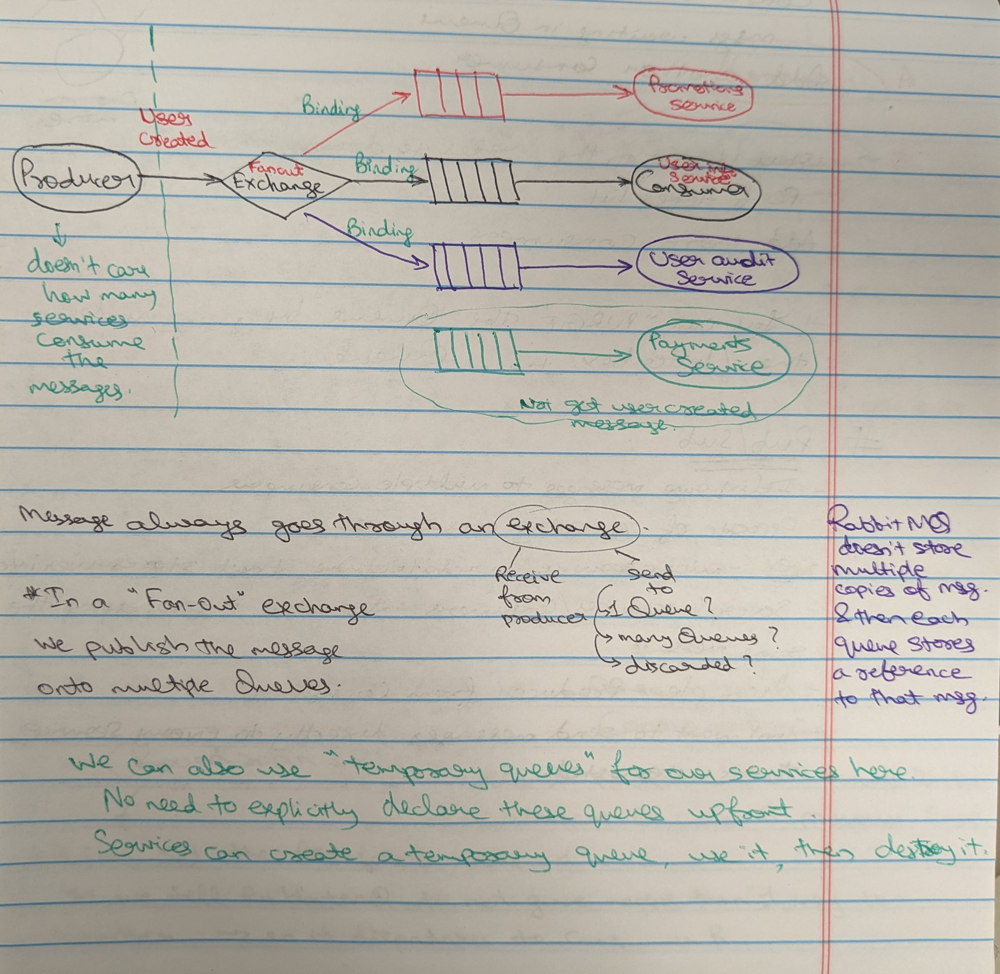

# RabbitMQ Tutorial

RabbitMQ is an open-source message broker software that is widely used for building scalable and robust messaging applications. It is based on the Advanced Message Queuing Protocol (AMQP) and is written in *Erlang*, a programming language known for its reliability and fault tolerance. RabbitMQ facilitates the exchange of data between different parts of an application, often in a distributed and asynchronous manner. Here are some key aspects of RabbitMQ in detail:

<u>**Message Broker**</u>: RabbitMQ acts as a middleman or broker between producers (applications that send messages) and consumers (applications that receive messages). It stores, routes, and delivers messages from producers to consumers based on predefined rules.

<u>**Queues**</u>: Messages in RabbitMQ are placed in queues. Queues act as temporary storage for messages until they are consumed by consumers. Queues follow a first-in-first-out (FIFO) pattern, meaning the first message added to a queue is the first one to be consumed.

<u>**Exchanges**</u>: Exchanges are responsible for routing messages from producers to queues. RabbitMQ supports several types of exchanges, including direct, topic, fanout, and headers. The choice of exchange type depends on how messages should be routed.

<u>**Direct Exchange**</u>: Routes messages to queues based on a routing key, which must exactly match the binding key specified by the consumer.

<u>**Topic Exchange**</u>: Routes messages to queues based on wildcard patterns in the routing key. This allows for more flexible routing.

<u>**Fanout Exchange**</u>: Forwards messages to all queues bound to the exchange, regardless of routing keys. This is useful for broadcasting messages to multiple consumers.

<u>**Headers Exchange**</u>: Routes messages based on header attributes rather than routing keys.

<u>**Bindings**</u>: Bindings are rules that connect exchanges to queues, defining how messages are routed. Producers send messages to exchanges, and exchanges use bindings to determine which queues should receive the messages.

<u>**Publish/Subscribe**</u>: RabbitMQ supports the publish/subscribe messaging pattern through fanout exchanges. In this pattern, a message published to a fanout exchange is delivered to all queues bound to that exchange, making it easy to broadcast messages to multiple consumers.

<u>**Message Acknowledgment**</u>: Consumers acknowledge the receipt of messages from RabbitMQ. This acknowledgment mechanism ensures that messages are not lost in transit. If a message is not acknowledged, RabbitMQ can re-queue it or move it to a dead-letter queue, depending on the configuration.

<u>**Message Durability**</u>: RabbitMQ allows you to mark messages and queues as durable. Durable messages and queues are persisted to disk, ensuring that they are not lost in case of a server restart or failure.

<u>**Clustering**</u>: RabbitMQ can be configured in a clustered setup to enhance reliability and scalability. Clustering enables multiple RabbitMQ nodes to work together as a single logical broker, sharing queues and messages across nodes.

<u>**Plugins**</u>: RabbitMQ has a plugin system that allows you to extend its functionality. You can add plugins to enable features like message transformation, authentication, and authorization.

<u>**Management and Monitoring**</u>: RabbitMQ provides a web-based management interface called the RabbitMQ Management Plugin. It offers tools for monitoring and managing RabbitMQ instances, including queue inspection, user management, and message tracing.

<u>**Language Support**</u>: RabbitMQ client libraries are available for various programming languages, including Java, Python, Ruby, .NET, and more, making it easy to integrate RabbitMQ into applications written in different languages.

<u>**Community and Ecosystem**</u>: RabbitMQ has an active and supportive community. Additionally, it integrates well with various other technologies and frameworks, making it a popular choice for building distributed and decoupled systems.

## Analogies

### Email Servers Analogy:
Think of email servers as the postal service for the digital world. Just like the postal service handles the sending, receiving, and distribution of physical mail, email servers handle the sending, receiving, and routing of digital messages.

<u>**Sending Mail**</u>: When you compose an email, it's similar to writing a letter. Your email client (e.g., Gmail, Outlook) acts like your personal mailbox. When you click "Send," your email client sends the message to the email server, which is like the local post office.

<u>**Receiving Mail**</u>: When someone sends you an email, it's like them dropping a letter in a mailbox. The email server collects and stores incoming emails for you, just as the post office collects and stores physical mail in your mailbox.

<u>**Routing and Delivery**</u>: Email servers determine where to send your email based on the recipient's address, much like the postal service routes physical mail to the right destination. If the recipient uses a different email provider (e.g., from Gmail to Yahoo), it's like sending a letter from one city to another.

<u>**Inbox and Spam**</u>: Your email server manages your inbox, where important emails go, and your spam folder, where unsolicited or potentially harmful emails are filtered out. It's similar to how the postal service sorts mail into your mailbox and throws junk mail into the trash.

<u>**Attachments**</u>: Just as you can include physical documents in an envelope, you can attach files to an email. These attachments are like sending documents with your letter.

---

### Post Office Analogy:
A post office serves as the central hub for the distribution of physical mail. Here's how it relates to various aspects of a post office:

<u>**Sending Letters**</u>: When you want to send a letter or package, you drop it into a mailbox. The post office collects these items, sorts them, and sends them to their respective destinations, just as email servers route emails to recipients.

<u>**Mailboxes**</u>: Your personal mailbox is like your email inbox. It's where mail is delivered to you. The post office ensures that mail reaches the correct mailbox, similar to how email servers deliver emails to the right recipients.

<u>**Mail Sorting**</u>: At the post office, mail is sorted based on addresses and postal codes. Similarly, email servers use recipient addresses to determine where to deliver emails.

<u>**Delivery Routes**</u>: Postal workers follow specific routes to deliver mail to individual houses. In the digital realm, email servers follow data routes to deliver messages to recipients' email clients.

<u>**Express Services**</u>: Some post offices offer express or priority services for faster delivery. In email, you can mark an email as "urgent" or use priority flags for quicker attention.

<u>**Return to Sender**</u>: If a letter cannot be delivered (e.g., wrong address), it's returned to the sender. Similarly, undeliverable emails can bounce back to the sender.

## AMQP

Advanced Message Queuing Protocol


When sending/receiving messages through rabbitMQ, the first frame is always the "Method Frame" that corresponds to the sending/receiving message.

Opening a connection & Declaring a Queue:


Publishing & Consuming Messages:



## Running RabbitMQ
- Installation using Chocolatey (Windows)

```cmd
choco install rabbitmq
```

- Pull and Run the RabbitMQ Docker Container:

```cmd
docker run -d --hostname rmq --name rabbit-server -p 8080:15672 -p 5672:5672 rabbitmq:3-management
```

You can access the RabbitMQ management UI in your web browser at http://localhost:8080/. Log in with the default credentials (username: guest, password: guest).

## Folder Contents
1. A simple Producer-Consumer/Publisher-Subscriber model

Demonstrates a simple example of using the RabbitMQ message broker with Python, where you have a publisher that sends messages to a queue and a consumer that receives and processes those messages. RabbitMQ is a message broker that allows different parts of your application to communicate by sending and receiving messages.

**Publisher Code:**
The publisher code is responsible for sending messages to a RabbitMQ queue. It begins by importing the 'pika' library, which is used for RabbitMQ communication. It establishes a connection to a RabbitMQ server running on the local machine or a specified hostname. A channel is created for communication with RabbitMQ, and a queue named 'letterbox' is declared. The publisher prepares a message, such as 'hello world,' and sends it to the 'letterbox' queue using the 'basic_publish' method. After successful publishing, it prints a confirmation message and closes the connection.

**Consumer Code:**
The consumer code is designed to receive and process messages from the same RabbitMQ 'letterbox' queue that the publisher uses. Similar to the publisher, it imports the 'pika' library and establishes a connection to the RabbitMQ server. A channel is created and associated with the 'letterbox' queue, which is declared if it doesn't already exist. The consumer sets up a callback function called 'on_message_received' to handle incoming messages, in this case, printing the received message. It then starts consuming messages from the queue using 'channel.start_consuming()'. The program will stay active and responsive to incoming messages, invoking the 'on_message_received' function each time a new message arrives.

2. Competing Consumers and a Producer

Simulating asynchronous message processing with a RabbitMQ consumer and a publisher.

The consumer simulates variable processing times for messages, while the publisher continuously sends messages to the queue. This example illustrates how RabbitMQ can be used to build distributed and resilient messaging systems, enabling components to work independently and handle varying workloads efficiently.

<u>*Problem:*</u><br>
What if producer is creating messages every 5 seconds and consumers consumes every 10 seconds. Consequentially, a queue backlog builds up, memory issues and eventually broker fails.

So, use the concept of competing consumers.

By default, RabbitMQ uses round-robin fashion to send messgaes to consumers. (A B A B A B ...)

**Scenario**:<br>
Producer produces every 5 seconds. <br>
Consumer A = 15 seconds to consume <br>
Consumer B = 2 seconds to consume <br>

Here, round-robin strategy fails! because Consumer B's consumption of messages will depend on the processing/consuming time taken by Consumer A.

**Solution**: We can set the prefetch value=1, so we tell the RabbitMQ to not give more than 1 message to a worker so Consumer B is not left idle. But, still messages build up in Queue.

Two Competing Consumers and One Producer:


3. Publisher-Subscriber

Demonstration of a publish-subscribe messaging pattern using the RabbitMQ message broker. In this pattern, there is a producer that sends messages to an exchange, and there are two consumers that receive messages from the same exchange. The exchange acts as a broadcaster, distributing messages to all bound queues (consumers) without knowing about them individually.

- This is the opposite of the Competing Consumers strategy. 
- This decouples the producer from consumer.
- We don't want to send messages directly to every service that's interested.

